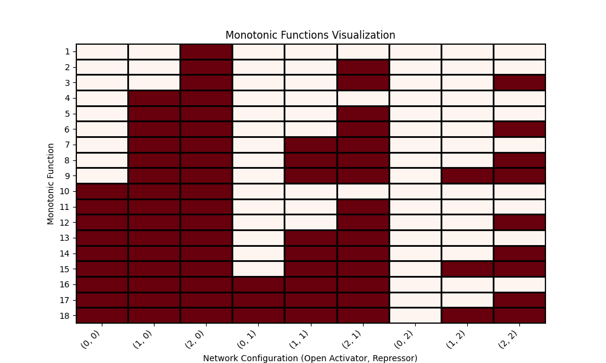

# Biological Computation Final Project

This program identifies all the monotonic regulation conditions of a reasoning engine based on specific activator and inhibitor configurations. The goal is to find the 18 unique monotonic regulation conditions that meet the monotonicity requirement under varying combinations of activators and inhibitors.

## How the Program Works

The program takes into account different network configurations with various combinations of activators and inhibitors. It systematically evaluates each configuration to determine if it satisfies the monotonic regulation conditions. The program uses these conditions to filter and identify the exact 18 configurations that meet the criteria.

### Key Features:

- **Evaluates Multiple Configurations:** The program checks different combinations of activators and inhibitors (open or closed) to find all possible monotonic regulation conditions.
- **Visualizes Results:** It generates a plot that visually represents the 18 configurations that satisfy the monotonic requirement.
- **Outputs Data to CSV:** The results are also saved in a CSV file for further analysis or record-keeping.

## How to Run the Program

1. **Clone the Repository:** Download the project files from the GitHub repository.

   ```bash
   git clone https://github.com/jonathantoaf/Biological-Computation-final-project.git
   cd monotonic-regulation-finder
   ```

2. **Install Requirements:** Ensure all necessary libraries are installed by running:

   ```bash
   pip install -r requirements.txt
   ```

3. **Run the Program:** Execute the Python script to find the monotonic regulation conditions and generate the outputs.

   ```bash
   python final_project.py
   ```

4. **View Outputs:**
   - The program will generate a plot (`plot.png`) that visualizes the 18 monotonic regulation conditions.
   - A CSV file (`monotonic_functions.csv`) will be created, containing the detailed data of all evaluated configurations.

## Output

### Plot

The generated plot visualizes the monotonic regulation conditions for different network configurations. Here's an example of what the plot looks like:



### CSV File

The program also saves the data to a CSV file named `monotonic_functions.csv`. This file contains the data used to generate the plot, listing all configurations and indicating whether each configuration satisfies the monotonic regulation conditions.

## GitHub Repository

All files, including the program code, requirements, plot image, and CSV data, are available on the GitHub repository. You can access them [here](https://github.com/jonathantoaf/Biological-Computation-final-project.git).

